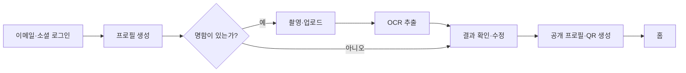
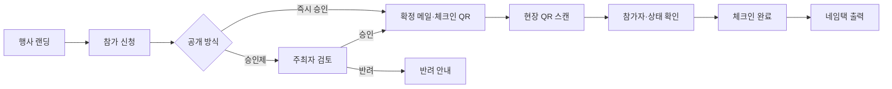
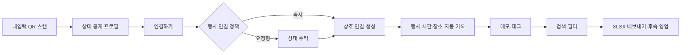
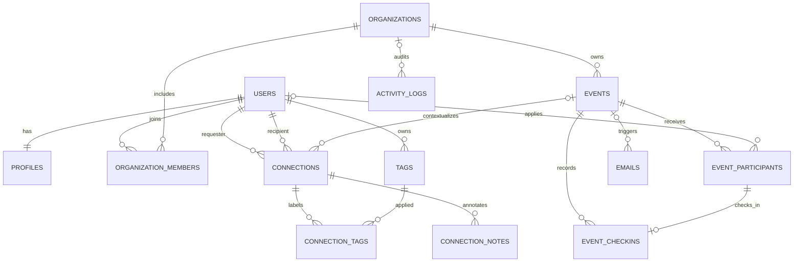

# NOOGU MVP — Product Requirement & Implementation Specification

버전 1.0 · 2026-06-20 · 모바일 우선 Event Networking SaaS

## 1. 제품 정의

NOOGU는 행사에서 발생한 오프라인 만남을 `사람 + 시간 + 장소 + 이유`의 맥락으로 저장해 행사 이후 후속 영업과 관계 관리로 전환하는 플랫폼이다. 명함 교환 도구가 아니라 **행사 기반 개인 네트워크 CRM**이다.

슬로건: **누구를, 언제, 어디서 만났는지.**

### 목표 사용자

| 사용자 | 핵심 목표 | 가장 중요한 순간 |
|---|---|---|
| 참가자 | 빠르게 연결하고 만남의 맥락을 기억 | 상대 QR 스캔 후 10초 안에 연결 |
| 주최자 | 신청부터 현장 운영, 성과 보고까지 통합 | 참가 승인, 체크인, 네임택, 리포트 |
| 운영 스태프 | 현장에서 오류 없이 참가자 처리 | QR 스캔 후 신원·승인 상태 즉시 확인 |

### MVP 성공 지표

- 승인 참가자 대비 체크인율 75% 이상
- 체크인 참가자 중 1회 이상 연결 생성률 60% 이상
- 연결 1건 생성 시간 중앙값 15초 이하
- 연결 후 24시간 이내 메모/태그 작성률 30% 이상
- 행사 종료 후 7일 이내 Excel 내보내기 사용률 15% 이상
- 주최자 행사 생성→게시 완료율 70% 이상

## 2. 범위와 원칙

### MVP 포함

인증, 프로필/OCR, 고유 프로필 QR, 행사 생성/랜딩, 참가 신청/승인, 이메일 큐, 체크인 QR, 네임택 PDF, 즉시 또는 승인형 연결, 메모/태그, 네트워크 검색/필터, 행사 이력, XLSX 내보내기, 주최자 대시보드, RLS/감사 로그.

### 후속 버전

AI 매칭 추천, 채팅, 좌석/세션 예약, 결제/티켓, CRM 양방향 동기화, NFC, 다국어 자동 번역, 고급 네트워크 그래프는 제외한다.

### 제품 원칙

1. 현장에서는 입력보다 스캔과 확인이 우선이다.
2. 연락처보다 만남의 맥락이 우선이다.
3. 상대의 비공개 정보는 연결 전 노출하지 않는다.
4. 모든 주요 작업은 모바일 한 손 조작으로 완료한다.
5. 관리자 화면은 데스크톱 밀도와 모바일 현장성을 함께 제공한다.

## 3. 전체 IA

```text
NOOGU
├─ 참가자 앱 (Bottom Navigation)
│  ├─ 홈: 오늘 행사 / 요약 / 최근 연결 / 빠른 실행
│  ├─ 행사: 탐색 / 신청 / 참여 이력 / 행사별 연결
│  ├─ QR: 내 프로필 QR / 공유 / 다운로드 / 스캔
│  ├─ 네트워크: 검색 / 태그·행사 필터 / 상세 / 메모 / 내보내기
│  └─ 프로필: 공개 프로필 / OCR 명함 / 공개 범위 / 계정
├─ 공개 웹
│  ├─ 행사 랜딩 / 참가 신청
│  ├─ 공개 프로필
│  ├─ 연결 QR 진입
│  └─ 체크인 QR 진입
└─ 주최자 센터
   ├─ 대시보드
   ├─ 행사 / 랜딩 빌더
   ├─ 참가자 / 승인 / 메일
   ├─ 체크인
   ├─ 네임택
   ├─ 네트워킹 리포트
   └─ 조직 멤버 / 권한 / 감사 로그
```

## 4. User Flow

### 참가자 최초 진입



### 행사 신청과 현장 체크인



### 연결과 사후 관리



## 5. Sitemap과 URL

| 경로 | 공개 | 목적 |
|---|---:|---|
| `/auth` | O | 이메일/소셜 인증 |
| `/onboarding` | 인증 | OCR 및 프로필 생성 |
| `/` | 인증 | 참가자 홈 |
| `/events` | 인증 | 행사 탐색/이력 |
| `/events/[slug]` | 인증 | 내 행사 상세/연결 이력 |
| `/event/[slug]` | O | SEO 행사 랜딩/신청 |
| `/qr` | 인증 | 내 QR 관리 |
| `/connect/[token]` | 제한 공개 | 상대 프로필과 연결 |
| `/checkin/[token]` | 스태프 | 체크인 처리 |
| `/network` | 인증 | 전체 연결 검색/필터 |
| `/network/[id]` | 연결 당사자 | 상세·메모·태그 |
| `/u/[handle]` | 공개 설정 | 공개 프로필 |
| `/profile` | 인증 | 프로필/명함/설정 |
| `/admin` | 주최자 | 운영 대시보드 |
| `/admin/events/new` | 관리자 | 행사 생성 |
| `/admin/events/[id]/participants` | 스태프 | 참가 승인/반려 |
| `/admin/nametags` | 스태프 | 네임택 PDF/인쇄 |

## 6. 화면 명세

| 화면 | 핵심 정보 | Primary action | 상태/예외 |
|---|---|---|---|
| 홈 | 오늘 행사, 연결·행사 통계, 최근 연결 | 내 QR 열기 | 오늘 행사 없음, 미완료 메모 |
| 프로필 온보딩 | 명함 이미지, OCR 결과 | 프로필 만들기 | 저신뢰 필드 강조, OCR 실패 시 수동 입력 |
| QR | 프로필 QR, 공개 URL | 공유/다운로드 | 오프라인에서도 캐시된 QR 표시 |
| 행사 랜딩 | Hero, 소개, 프로그램, 일시, 장소, FAQ | 참가 신청 | 마감, 정원 초과, 비공개 초대 코드 |
| 참가 신청 | 연락처, 관심사, 명함, 소개 | 승인 요청 | 기존 신청 발견, 필수 동의 |
| 참가자 관리 | 검색, 필터, 상태, 일괄 선택 | 승인/반려 | 중복 처리 방지, 이메일 재전송 |
| 체크인 | 이름, 소속, 승인 상태 | 체크인 완료 | 이미 체크인, 반려/미등록, 다른 행사 QR |
| 네임택 | 로고, 이름, 회사, 직급, QR | PDF/즉석 출력 | 긴 이름 축소, QR 대비 검사 |
| 연결 프로필 | 공개 정보, 현재 행사 | 연결하기 | 자기 자신, 기존 연결, 만료 QR |
| 네트워크 | 사람, 회사, 태그, 행사, 연결일 | 상세 보기 | 빈 결과, 삭제된 상대 계정 |
| 연결 상세 | 프로필, 만난 때/장소/행사, 메모/태그 | 메모 편집 | 메모는 사용자별 비공개 |
| 행사 이력 | 행사, 일시, 장소, 연결 수 | 행사별 다운로드 | 취소 행사, 접근 종료 행사 |
| 관리자 대시보드 | 행사/참가자/연결/체크인 | 행사 만들기 | 역할에 따라 액션 숨김 |

## 7. 컴포넌트 구조

```text
RootLayout
├─ PublicShell
│  ├─ EventLanding
│  │  ├─ EventHero / Program / Venue / FAQ
│  │  └─ RegistrationForm
│  └─ PublicProfile / ConnectAction
├─ MobileShell
│  ├─ TopBar / BottomNavigation
│  ├─ HomeDashboard
│  ├─ EventList / EventCard / EventDetail
│  ├─ QRPanel / QRDownloadActions
│  ├─ NetworkSearch / FilterChips / PersonRow
│  └─ ConnectionDetail / NoteEditor / TagEditor
└─ AdminShell
   ├─ AdminSidebar / MetricCard
   ├─ EventForm / LandingBlockEditor
   ├─ ParticipantTable / BulkActions
   ├─ CheckinScanner / CheckinResult
   ├─ NametagPreview / PrintSettings
   └─ ReportCharts / ExportDialog
```

서버 컴포넌트를 기본으로 사용하고 카메라, 검색, 선택, 폼 상태처럼 브라우저 상태가 필요한 최소 범위만 Client Component로 분리한다.

## 8. Database ERD



원칙: `connections`는 두 사람의 공유 연결 사실만 저장한다. 메모와 태그는 작성자별 개인 정보이므로 별도 테이블에 저장한다. QR 원문 토큰은 DB에 저장하지 않고 해시만 저장하며, 만료·회전 가능한 서명 토큰을 사용한다.

## 9. API 설계

모든 응답: `{ data, error, meta }`. 변경 요청은 `Idempotency-Key`를 지원하고, 관리자 변경은 `activity_logs`에 기록한다.

| Method | Endpoint | Auth/Role | 설명 |
|---|---|---|---|
| POST | `/api/ocr/business-card` | User | 이미지 업로드→OCR 필드+confidence |
| GET/PATCH | `/api/profile` | User | 내 프로필 조회/수정 |
| GET | `/api/profiles/[handle]` | Public policy | 공개 프로필 |
| POST | `/api/qr/profile` | User | 회전 가능한 프로필 QR payload |
| POST | `/api/events` | Org admin | 행사 생성 |
| GET/PATCH | `/api/events/[id]` | Public/Admin | 랜딩 조회/편집 |
| POST | `/api/events/[id]/applications` | Public | 참가 신청 |
| GET | `/api/events/[id]/participants` | Staff | 검색·상태·커서 페이지네이션 |
| PATCH | `/api/events/[id]/participants/[pid]` | Staff | 승인/반려 |
| POST | `/api/events/[id]/participants/bulk` | Staff | 일괄 승인/반려 |
| POST | `/api/checkins/resolve` | Staff | QR 해석, 참가자 상태 조회 |
| POST | `/api/checkins` | Staff | 체크인 원자 처리 |
| POST | `/api/connections/resolve` | User | QR 상대/행사 확인 |
| POST | `/api/connections` | User | 연결 요청 또는 즉시 연결 |
| PATCH | `/api/connections/[id]` | Party | 수락/차단 |
| PUT | `/api/connections/[id]/note` | Party | 사용자 개인 메모 upsert |
| POST/DELETE | `/api/connections/[id]/tags` | Party | 개인 태그 지정/해제 |
| GET | `/api/network` | User | query, event, tag, cursor 필터 |
| GET | `/api/exports/connections.xlsx` | User | 전체/행사별 XLSX |
| POST | `/api/events/[id]/nametags.pdf` | Staff | 선택 참가자 PDF 생성 |
| GET | `/api/admin/events/[id]/report` | Admin | 체크인/연결 KPI |

### 중요 요청 예시

```json
POST /api/connections
{
  "token": "signed-short-lived-token",
  "eventId": "uuid",
  "clientOccurredAt": "2027-03-20T14:23:18+09:00"
}
```

```json
{
  "data": {
    "id": "uuid",
    "status": "connected",
    "context": { "event": "Fashion Networking Day", "venue": "XYZ Seoul" }
  },
  "error": null
}
```

## 10. OCR, QR, Excel, PDF 구현

- OCR: 클라이언트에서 EXIF 제거·리사이즈 → private Storage → 서버 OCR provider 호출 → 항목별 confidence 반환 → 사용자가 확인해야 프로필 반영. 원본 명함 접근은 signed URL 5분.
- QR: `type`, `subject`, `event`, `exp`, `nonce`를 담은 서명 토큰. 프로필 QR은 장기/회전형, 체크인·연결 QR은 행사 범위와 만료가 필수. 해시 비교와 rate limit 적용.
- Excel: 서버에서 스트리밍 생성. 컬럼은 행사명, 연결일, 연결시간, 이름, 회사, 직급, 이메일, 전화, 웹사이트, 태그, 메모. Formula injection 방지를 위해 `=`, `+`, `-`, `@` 시작 셀 escape.
- 네임택: HTML/CSS print 또는 PDF 엔진으로 A4 다중 배치. QR quiet zone 4 modules, 최소 25mm, 검정/흰색 대비 유지.

## 11. 권한과 보안

| 자원 | 참가자 본인 | 연결 상대 | Staff | Admin/Owner | Public |
|---|---:|---:|---:|---:|---:|
| 내 계정/프로필 편집 | CRUD | - | - | - | - |
| 공개 프로필 | R | R | R | R | 공개 설정 시 R |
| 참가 신청 | R/U(pending) | - | R/U | CRUD | C |
| 체크인 | R(본인) | - | C/R | CRUD | - |
| 연결 | CRUD(당사자) | CRUD(당사자) | 집계 | 집계 | - |
| 개인 메모/태그 | CRUD | 접근 불가 | 접근 불가 | 접근 불가 | - |
| 이벤트 | R | R | R/U | CRUD | 게시 시 R |

- Supabase service-role은 서버 전용이며 클라이언트 번들에 포함하지 않는다.
- RLS는 모든 public table에서 강제한다. 관리자 UI의 숨김은 보조 수단이고 실제 권한은 RLS/RPC에서 판정한다.
- 참가자 목록·메일·명함은 민감 정보로 private bucket과 signed URL을 사용한다.
- 체크인/연결 API는 사용자+IP+token 단위 rate limit과 nonce replay 방지를 적용한다.
- 개인정보 다운로드/삭제, 보존 기간, 마케팅 동의를 분리한다. 감사 로그에는 원문 IP 대신 hash를 기록한다.

## 12. 모바일 UI 시스템

- 컬러: Ink `#17181A`, Paper `#F6F6F2`, Card `#FFFFFF`, Signal Lime `#BBF34A`, Violet `#7C5CFF`.
- 4pt 기반 spacing, 카드 radius 22px, 터치 타깃 최소 44px.
- 모바일은 Bottom Navigation, 주최자 데스크톱은 Sidebar. QR 탭은 현장 접근성을 위해 시각적 중심으로 강조한다.
- 제목은 높은 대비와 타이트한 자간, 본문은 15px/1.55 이상. 색상만으로 상태를 구분하지 않고 라벨을 병기한다.
- PWA: standalone, theme color, 핵심 QR/행사 정보 오프라인 캐시. 체크인 변경은 온라인에서만 확정하고 오프라인 큐는 별도 운영 정책이 있을 때 도입한다.
- SEO: 공개 행사/프로필만 SSR, canonical/OpenGraph/Event JSON-LD, 비공개·관리자·연결 토큰 페이지는 `noindex`.

## 13. 주최자 기능 상세

1. 대시보드: 행사/신청/승인/체크인/연결 funnel, 시간대별 체크인, 연결 상위 세션.
2. 행사 관리: 기본 정보, 공개 방식, 랜딩 블록, 로고/컬러, 연결 정책, 이메일 템플릿.
3. 참가자: 검색, 상태/관심사 필터, 일괄 승인/반려, CSV, 메일 재전송.
4. 현장: 카메라 스캐너, 수동 검색, 중복 체크인 경고, 최근 처리 내역.
5. 네임택: 템플릿, 용지/배치, 선택 대상, QR 검증, PDF/즉석 인쇄.
6. 리포트: 승인→체크인→연결 전환, 참가자당 평균 연결, XLSX/CSV.
7. 조직 권한: Owner, Admin, Staff, Viewer. Staff는 체크인/참가자 처리, Viewer는 집계 조회만 허용.

## 14. 개발 우선순위

| 단계 | 기간 예시 | 결과물 | 종료 조건 |
|---|---|---|---|
| P0 기반 | 1주 | Auth, Supabase schema/RLS, 디자인 토큰, 로그 | 권한 테스트 통과 |
| P1 프로필 | 1주 | 온보딩, OCR, 공개 프로필, QR | OCR 수정→프로필 반영 E2E |
| P2 행사 | 2주 | 생성, 랜딩, 신청, 승인, 이메일 | 공개/승인제 상태 전이 E2E |
| P3 현장 | 1.5주 | 체크인 QR, 스캐너, 네임택 PDF | 중복·오류·재출력 시나리오 통과 |
| P4 네트워크 | 1.5주 | 연결, 메모, 태그, 검색, 이력 | 양 당사자/비당사자 RLS 통과 |
| P5 내보내기 | 1주 | XLSX, 리포트, PWA/SEO | 대용량 export 및 Lighthouse 검증 |
| P6 Pilot | 1주 | 모니터링, QA, 운영 매뉴얼 | 실제 행사 dry-run 완료 |

총 8주 예시, FE 1 + BE 1 + Product/Design 1 기준. OCR/메일/PDF provider 선정과 실제 프린터 기종 검증은 P0에 확정한다.

## 15. QA Acceptance Criteria

- 같은 행사에서 같은 두 사용자의 연결은 한 건만 생성된다.
- 승인되지 않은 참가자 QR로 체크인할 수 없다.
- 체크인 재시도는 성공 응답을 반환하되 중복 row를 만들지 않는다.
- 참가자 A의 메모/태그를 연결 상대 B나 주최자가 읽을 수 없다.
- 행사 종료 후에도 사용자에게 허용된 연결은 유지된다.
- XLSX는 필터 조건과 타임존(행사 로컬 시간)을 보존한다.
- 공개 행사 랜딩은 JS 없이 핵심 정보가 렌더되고 Event structured data를 제공한다.
- 360px 너비에서 가로 스크롤 없이 주요 행동이 가능하며, 관리자 표만 의도적 횡스크롤을 허용한다.

## 16. 현재 프로토타입 범위

이 저장소에는 참가자 홈/행사/QR/네트워크/프로필, 공개 행사/프로필, OCR 온보딩, 연결, 주최자 대시보드/행사 생성/참가 승인/체크인/네임택의 반응형 인터랙티브 프론트엔드와 Supabase 실행 스키마가 포함된다. 외부 OCR·메일·PDF provider와 Supabase 프로젝트 키는 배포 환경에서 연결하는 integration boundary로 남겨두었다.
